# Enterprise Knowledge Integrity MCP Server

> **An MCP server that detects when authoritative enterprise knowledge changes, traces what depends on it, finds contradictions, assesses risk, proposes fixes, and records everything — all through MCP tools an LLM can orchestrate.**

---

## Table of Contents

- [Project Overview](#project-overview)
- [Features](#features)
- [Architecture](#architecture)
- [Project Structure](#project-structure)
- [Module Documentation](#module-documentation)
- [Service Documentation](#service-documentation)
- [MCP Tool Documentation](#mcp-tool-documentation)
- [MCP Resources](#mcp-resources)
- [MCP Prompts](#mcp-prompts)
- [Data Layer](#data-layer)
- [Type Definitions](#type-definitions)
- [Complete Investigation Pipeline](#complete-investigation-pipeline)
- [Example End-to-End Workflow](#example-end-to-end-workflow)
- [API Reference](#api-reference)
- [Development Guide](#development-guide)
- [Build & Run](#build--run)
- [Demo Guide](#demo-guide)
- [Troubleshooting](#troubleshooting)
- [Future Improvements](#future-improvements)
- [Technical Deep Dive](#technical-deep-dive)

---

## Project Overview

### Purpose

Enterprise knowledge bases rot silently. When a policy changes — a discount limit drops from 20% to 10%, a retention period extends from 5 to 7 years, a password rotation requirement tightens from 180 to 90 days — dozens of downstream documents across multiple departments become stale or contradictory. Sales teams quote wrong discounts. Training materials teach wrong processes. Compliance documents reference old rules. Nobody knows until something breaks.

This MCP server solves that problem by providing a programmable knowledge integrity pipeline that any MCP-compatible LLM can discover and orchestrate.

### Problem Statement

Large enterprises maintain hundreds of policy documents, playbooks, templates, and guides across departments. These documents reference authoritative facts from policy documents. When an authoritative fact changes, there is no automated mechanism to:

1. Detect which facts changed
2. Trace which documents depend on those facts
3. Validate whether dependent claims are still accurate
4. Identify contradictions across documents
5. Assess the business risk of each contradiction
6. Propose corrections
7. Require human approval before applying changes
8. Maintain a complete audit trail

### Why MCP

The Model Context Protocol (MCP) provides the ideal abstraction for this problem because:

- **LLM-orchestrated**: An LLM client (Claude, ChatGPT, NitroStudio) discovers the tools at runtime and chains them together intelligently. The LLM decides the investigation strategy; the server provides the evidence.
- **Composable tools**: Each tool performs one focused operation. The LLM composes them into investigation workflows without requiring hardcoded orchestration logic.
- **Human-in-the-loop**: The separation between `propose_knowledge_update` and `approve_knowledge_update` enforces a human approval gate — the server never modifies data without explicit authorization.
- **Transport-agnostic**: Works over STDIO (for Claude Desktop, NitroStudio) and HTTP SSE (for web-based clients).

### Enterprise Use Case

A compliance officer asks: *"Has any important company knowledge become invalid after the latest policy changes?"*

The LLM discovers the MCP tools and performs:
1. `detect_source_changes` — finds 7 fact changes across 4 policies
2. `find_affected_knowledge` — traces to 15+ dependent claims across 12+ documents
3. `detect_knowledge_conflicts` — identifies confirmed contradictions
4. `assess_knowledge_risk` — scores each conflict by business impact
5. `trace_knowledge_provenance` — shows which version each claim traces to
6. `propose_knowledge_update` — generates corrections
7. `approve_knowledge_update` — applies after human review
8. `get_audit_log` — records the complete change history

### Architecture Goals

- **No external APIs**: The entire knowledge base is self-contained in JSON files. The demo is 100% reliable and reproducible.
- **Deterministic risk scoring**: Risk scores are calculated by the server using weighted factors, not hallucinated by the LLM.
- **Separation of concerns**: MCP tool handlers are thin wrappers; business logic lives in services; data access is isolated in the DataLoaderService.
- **Type safety**: Zod schemas validate all data at load time and at tool input boundaries.
- **Auditability**: Every modification is recorded with timestamps, reasons, and risk levels.

### Design Philosophy

The server follows the principle that **the MCP server provides evidence, and the LLM provides reasoning**. The server computes deterministic results (change detection, value matching, risk scoring). The LLM interprets results and communicates them to the user in natural language. This separation ensures consistency and reproducibility while leveraging the LLM's strength in natural language understanding.

---

## Features

### Change Detection

The server maintains two snapshots of authoritative enterprise sources: the current version (v2) and the previous version (v1). When `detect_source_changes` is called, every fact across every authoritative source is compared between the two versions. Only facts where the value differs are reported. This comparison is fact-level, not document-level — the server identifies exactly which values changed, not just which policies changed.

### Dependency Graph Traversal

A pre-computed dependency graph maps each authoritative fact to every document claim that references it. When a fact changes, `find_affected_knowledge` traverses this graph to find every affected document and claim. The graph supports both `direct` and `indirect` dependency types (though the current synthetic data uses only direct dependencies).

### Claim-Level Validation

Rather than marking entire documents as outdated, the server validates individual claims. Each claim is compared against its authoritative fact using deterministic pattern matching:

- Claims containing the current authoritative value are marked `VALID`
- Claims containing a different explicit value are marked `CONFLICT`
- Claims referencing policy generically ("current policy", "as per policy") are marked `AMBIGUOUS`

This granularity means a single document can have some claims that are valid and others that conflict.

### Cross-Document Conflict Detection

`detect_knowledge_conflicts` compares every claim connected to the same authoritative fact. The result is a complete breakdown: how many claims conflict, how many are valid, how many are ambiguous, with per-claim explanations.

### Knowledge Provenance Tracing

For any claim, `trace_knowledge_provenance` constructs the complete version history of the authoritative source it depends on. It shows which version the claim was based on (v1), what the current version is (v2), and whether the claim is current or superseded. The conclusion is generated deterministically based on the validation result.

### Deterministic Risk Scoring

Risk is calculated by the server using a weighted scoring formula, not by the LLM. The score is based on six factors:

| Factor | Weight | Detection Method |
|--------|--------|------------------|
| Confirmed conflict | +30 | Claim validation returned CONFLICT |
| Customer-facing | +25 | Document's `customer_facing` field |
| Financial impact | +20 | Fact key/text matches financial keywords |
| Compliance impact | +15 | Fact key/text matches compliance keywords |
| Document criticality | +0 to +10 | Document's `criticality` field |
| Operational impact | (reported) | Fact key/text matches operational keywords |

Risk levels: CRITICAL (≥80), HIGH (≥60), MEDIUM (≥40), LOW (<40).

### Remediation with Human Approval

`propose_knowledge_update` creates a correction proposal with status `AWAITING_APPROVAL`. The server auto-generates replacement text by replacing the old authoritative value with the new one in the claim text, or accepts custom replacement text. No data is modified until `approve_knowledge_update` is explicitly called.

### Approval Workflow with Staleness Detection

When approving, the server verifies that the claim text hasn't changed since the proposal was created. If the claim was already modified (by another approval or external change), the proposal is marked stale and rejected. This prevents applying outdated corrections.

### Rollback on Failure

If applying an approved update fails after the proposal status changes, the server attempts a best-effort rollback: reverting the document claim text and restoring the proposal status. This keeps the JSON data stores aligned.

### Complete Audit Trail

Every approved or rejected update is recorded in the audit log with: document ID, claim ID, old value, new value, authoritative source, reason, risk level, and timestamp. The audit log is filterable by document ID and supports configurable limits.

### Batch Operations

The investigation tool (`investigate_knowledge_change`) and `RemediationService.proposeUpdates` support batch operations. Proposals are validated atomically — if any request is invalid, no proposals are created, preventing partial state.

### MCP Resources

Three read-only resources expose the knowledge base for LLM browsing: authoritative sources, enterprise documents, and pending updates. These allow the LLM to explore the data without calling tools.

### MCP Prompts

Two prompt templates guide the LLM through established investigation workflows: `investigate_policy_change` (scoped to a specific policy or all changes) and `knowledge_health_check` (comprehensive audit of all knowledge consistency).

---

## Architecture

### System Architecture

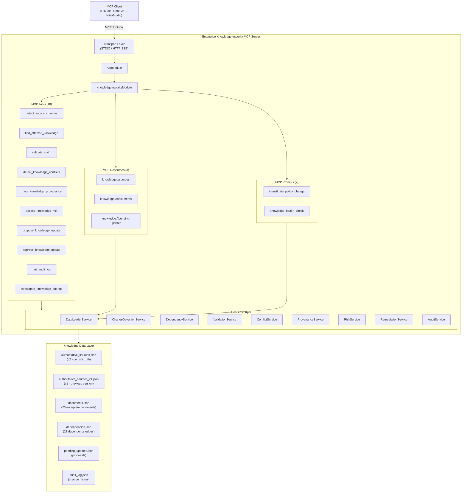

### Module Diagram

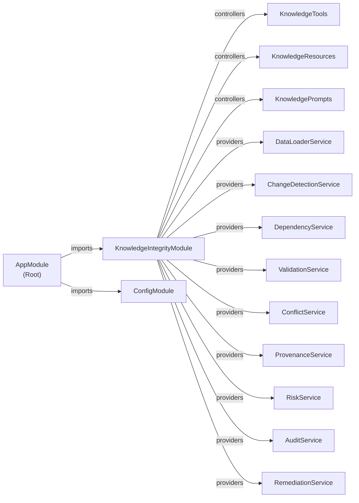

### Request Flow

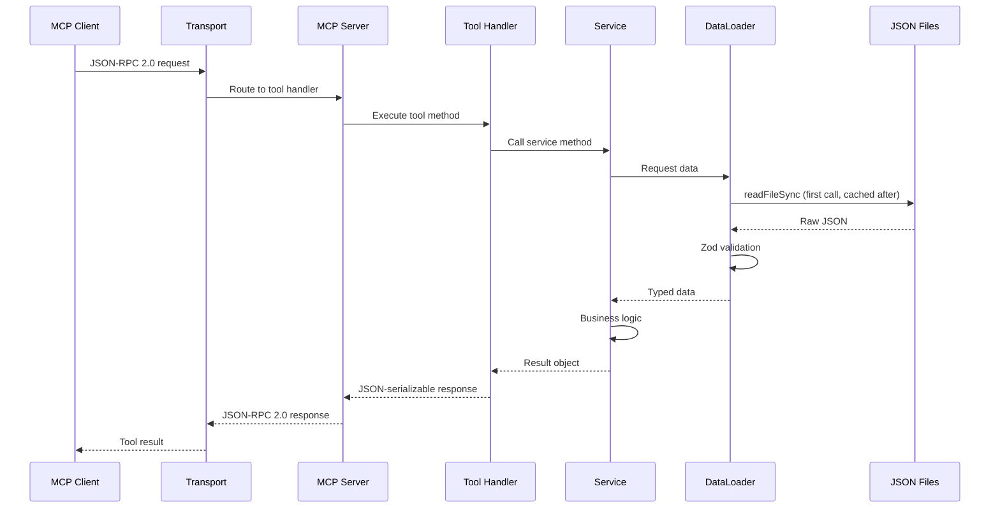

### Tool Execution Flow

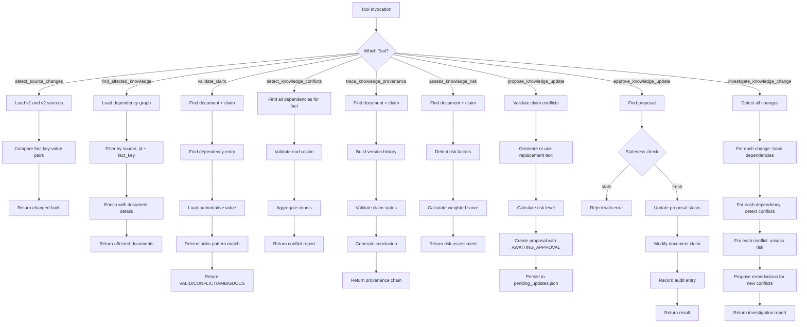

### Knowledge Investigation Flow

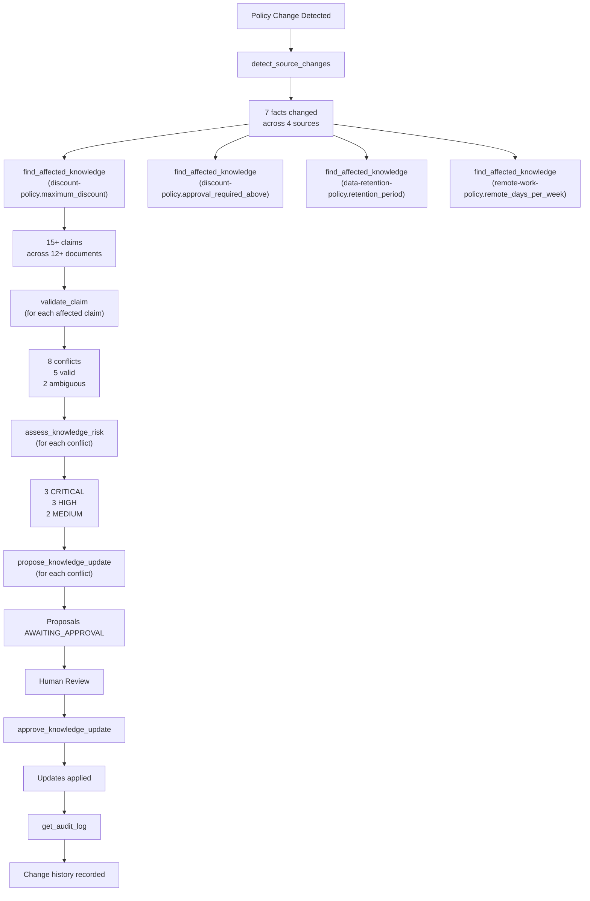

### Data Flow

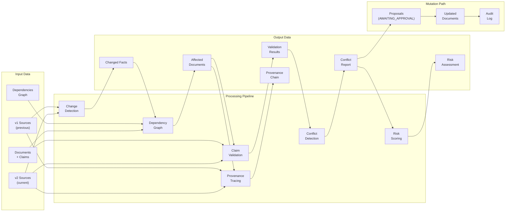

### Dependency Relationships

```mermaid
graph TD
    subgraph Sources["Authoritative Sources"]
        DP["discount-policy<br/>(v2.0)"]
        DRP["data-retention-policy<br/>(v2.0)"]
        RWP["remote-work-policy<br/>(v2.0)"]
        VAP["vendor-approval-policy<br/>(v1.0)"]
        SP["security-policy<br/>(v3.0)"]
        EP["expense-policy<br/>(v2.1)"]
    end
    
    subgraph Facts["Key Facts"]
        MD["maximum_discount: 10%"]
        ARA["approval_required_above: 5%"]
        DA["discount_authority: VP Sales"]
        RP["retention_period: 7 years"]
        DM["deletion_method: certified"]
        RDW["remote_days_per_week: 3"]
        ES["equipment_stipend: $1000"]
        AT["approval_threshold: $10,000"]
        PR["password_rotation: 90 days"]
        MPD["meal_per_diem: $75"]
        MHR["max_hotel_rate: $200"]
    end
    
    subgraph Documents["Dependent Documents"]
        SP_D["sales-playbook"]
        PT["proposal-template"]
        PG["pricing-guide"]
        ST["sales-training"]
        DAS["discount-approval-sop"]
        PA["partner-agreement"]
        QRD["quarterly-review-deck"]
        DHG["data-handling-guide"]
        PF["privacy-faq"]
        CC["compliance-checklist"]
        RWG["remote-work-guide"]
        OH["onboarding-handbook"]
        ISG["it-setup-guide"]
        VO["vendor-onboarding"]
        PS["procurement-sop"]
        SEC["security-training"]
        SQS["security-quickstart"]
        IR["incident-response"]
        TG["travel-guidelines"]
        EF["expense-faq"]
    end
    
    DP --> MD
    DP --> ARA
    DP --> DA
    DRP --> RP
    DRP --> DM
    RWP --> RDW
    RWP --> ES
    VAP --> AT
    SP --> PR
    EP --> MPD
    EP --> MHR
    
    MD --> SP_D
    MD --> PT
    MD --> PG
    MD --> ST
    MD --> PA
    MD --> QRD
    ARA --> SP_D
    ARA --> PG
    DA --> DAS
    RP --> DHG
    RP --> PF
    RP --> CC
    DM --> CC
    RDW --> RWG
    ES --> OH
    ES --> ISG
    AT --> VO
    AT --> PS
    PR --> SEC
    PR --> SQS
    MPD --> TG
    MHR --> EF
```

### Remediation Workflow

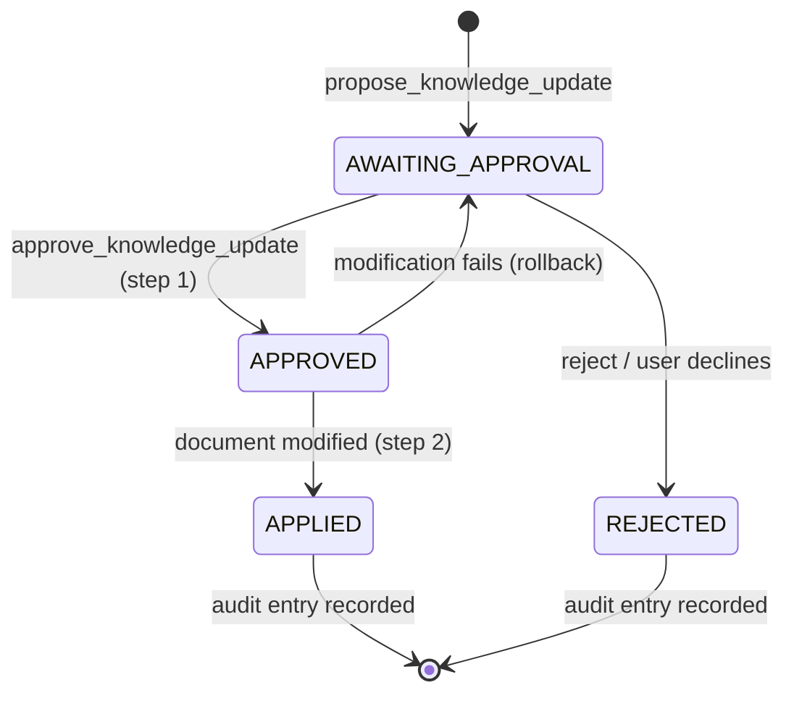

### Approval Workflow

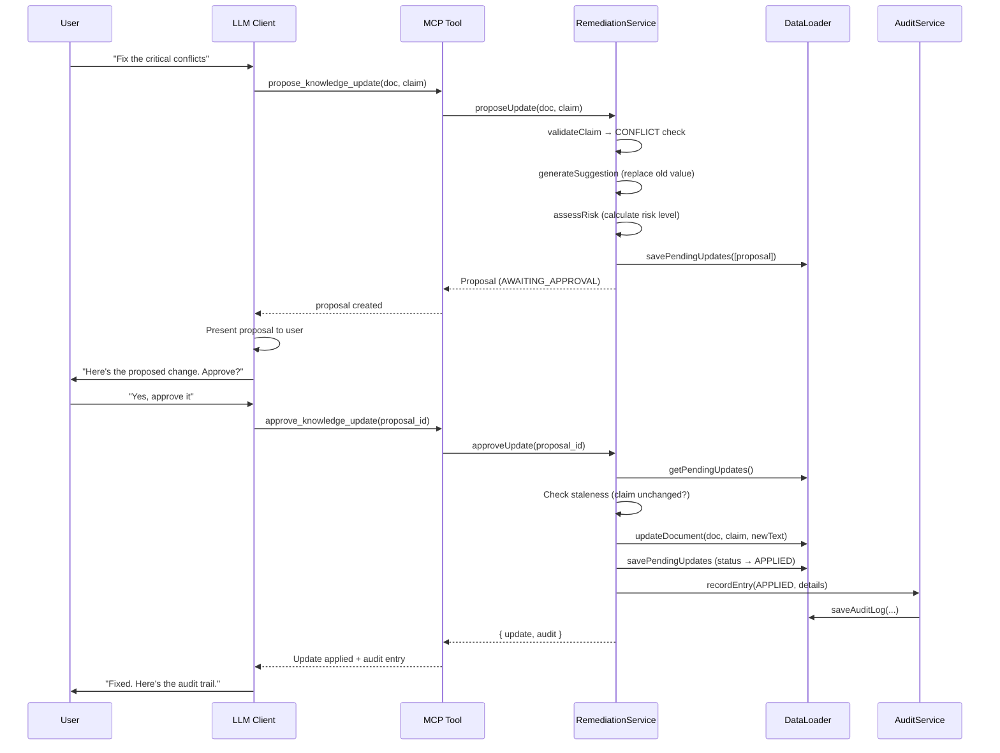

### Audit Workflow

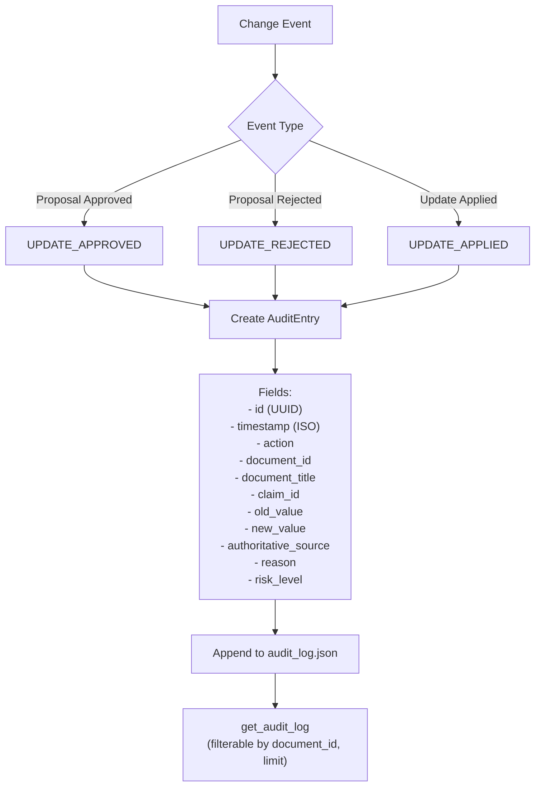

---

## Project Structure

```
my-mcp-server/
├── src/
│   ├── index.ts                              # Entry point — bootstraps the MCP server
│   ├── app.module.ts                         # Root module — configures server metadata
│   │
│   ├── health/
│   │   └── system.health.ts                  # System health check (memory, uptime)
│   │
│   ├── types/
│   │   └── index.ts                          # All TypeScript interfaces and type aliases
│   │
│   ├── data/                                 # Synthetic enterprise knowledge base
│   │   ├── authoritative_sources.json        # Current (v2) authoritative sources
│   │   ├── authoritative_sources_v1.json     # Previous (v1) sources for change detection
│   │   ├── documents.json                    # 23 enterprise documents with claims
│   │   ├── dependencies.json                 # 23 dependency edges (fact → claim)
│   │   ├── pending_updates.json              # Remediation proposals (starts empty)
│   │   ├── audit_log.json                    # Change history (starts empty)
│   │   └── README.md                         # Data directory documentation
│   │
│   ├── services/                             # Business logic layer
│   │   ├── index.ts                          # Barrel exports
│   │   ├── data-loader.service.ts            # JSON read/write with Zod validation
│   │   ├── change-detection.service.ts       # v1 vs v2 fact comparison
│   │   ├── dependency.service.ts             # Dependency graph traversal
│   │   ├── validation.service.ts             # Deterministic claim validation
│   │   ├── conflict.service.ts               # Cross-document contradiction detection
│   │   ├── provenance.service.ts             # Knowledge origin tracing
│   │   ├── risk.service.ts                   # Deterministic risk scoring
│   │   ├── remediation.service.ts            # Proposal creation and approval
│   │   └── audit.service.ts                  # Audit trail management
│   │
│   ├── modules/
│   │   └── knowledge/                        # MCP module
│   │       ├── knowledge.module.ts           # Module registration + DI wiring
│   │       ├── knowledge.tools.ts            # 10 MCP tool handlers
│   │       ├── knowledge.resources.ts        # 3 MCP resources
│   │       └── knowledge.prompts.ts          # 2 MCP prompts
│   │
│   └── widgets/                              # Optional UI widgets (out of scope)
│
├── tests/
│   ├── phase4.test.ts                        # Core services: detection, dependency, validation
│   ├── phase7.test.ts                        # Remediation: propose, approve, audit
│   ├── phase8.test.ts                        # Investigation tool, batch ops, prompts
│   └── phase9.test.ts                        # MCP client connection verification
│
├── examples/
│   └── claude-desktop.config.json            # Claude Desktop MCP configuration
│
├── package.json
├── tsconfig.json                             # Production TypeScript config
├── tsconfig.test.json                        # Test TypeScript config
├── .env.example                              # Environment variable template
├── .gitignore
├── plan.md                                   # Implementation plan
└── README.md                                 # This file
```

### Directory Responsibilities

| Directory | Purpose | Why It Exists |
|-----------|---------|---------------|
| `src/` | Application source code | All runtime logic |
| `src/data/` | JSON knowledge base files | Self-contained synthetic data — no external dependencies |
| `src/services/` | Business logic | Separates MCP protocol from domain logic; each service has a single responsibility |
| `src/modules/knowledge/` | MCP tool/resource/prompt definitions | Thin handlers that delegate to services |
| `src/types/` | TypeScript interfaces | Shared type definitions used across all layers |
| `src/health/` | System health checks | NitroStack convention for monitoring |
| `tests/` | Test suites | Validates each phase of the implementation |

---

## Module Documentation

### AppModule

**File:** `src/app.module.ts`

**Purpose:** Root application module that configures the MCP server identity and imports all feature modules.

**Responsibilities:**
- Configures server name (`knowledge-integrity-server`) and version (`1.0.0`)
- Sets logging level to `info`
- Imports `ConfigModule.forRoot()` for environment configuration
- Imports `KnowledgeIntegrityModule` for all knowledge integrity features
- Provides `SystemHealthCheck` for system monitoring

**Decorators:** `@McpApp` (server metadata), `@Module` (module registration)

**Dependencies:** `ConfigModule`, `KnowledgeIntegrityModule`, `SystemHealthCheck`

---

### KnowledgeIntegrityModule

**File:** `src/modules/knowledge/knowledge.module.ts`

**Purpose:** Feature module that registers all MCP tools, resources, prompts, and their backing services.

**Responsibilities:**
- Registers 3 controllers: `KnowledgeTools`, `KnowledgeResources`, `KnowledgePrompts`
- Provides 9 services with dependency injection
- Exports all services for use by other modules (if needed)

**Controllers:**

| Controller | Type | Count |
|-----------|------|-------|
| `KnowledgeTools` | Tool handler | 10 tools |
| `KnowledgeResources` | Resource provider | 3 resources |
| `KnowledgePrompts` | Prompt template | 2 prompts |

**Providers (Services):**

| Service | Dependencies |
|---------|-------------|
| `DataLoaderService` | None (reads JSON files directly) |
| `ChangeDetectionService` | `DataLoaderService` |
| `DependencyService` | `DataLoaderService` |
| `ValidationService` | `DataLoaderService` |
| `ConflictService` | `DataLoaderService`, `DependencyService`, `ValidationService` |
| `ProvenanceService` | `DataLoaderService`, `ValidationService` |
| `RiskService` | `DataLoaderService`, `ValidationService` |
| `AuditService` | `DataLoaderService` |
| `RemediationService` | `DataLoaderService`, `AuditService`, `RiskService`, `ValidationService` |

---

## Service Documentation

### DataLoaderService

**File:** `src/services/data-loader.service.ts`

**Purpose:** Central data access layer that reads and writes all JSON data files. Every other service depends on this. Implements lazy loading with in-memory caching and Zod schema validation on load.

**Why it exists:** Isolates file I/O from business logic. Ensures all data is validated against schemas before use. Provides atomic writes using a temp-file-then-rename strategy.

**Public Methods:**

| Method | Input | Output | Description |
|--------|-------|--------|-------------|
| `getAuthoritativeSources()` | none | `AuthoritativeSource[]` | Current (v2) sources — the ground truth |
| `getPreviousSources()` | none | `AuthoritativeSource[]` | Previous (v1) sources — for change detection |
| `getDocuments()` | none | `Document[]` | All 23 enterprise documents with claims |
| `getDependencies()` | none | `Dependency[]` | Pre-computed dependency graph |
| `getPendingUpdates()` | none | `ProposedUpdate[]` | Pending remediation proposals |
| `getAuditLog()` | none | `AuditEntry[]` | Approved-change history |
| `getSourceById(id)` | `string` | `AuthoritativeSource \| undefined` | Find source by ID (O(1) via Map index) |
| `getPreviousSourceById(id)` | `string` | `AuthoritativeSource \| undefined` | Find previous source by ID |
| `getDocumentById(id)` | `string` | `Document \| undefined` | Find document by ID |
| `savePendingUpdates(updates)` | `ProposedUpdate[]` | `void` | Overwrite pending_updates.json |
| `saveAuditLog(entries)` | `AuditEntry[]` | `void` | Overwrite audit_log.json |
| `updateDocument(docId, claimId, newText)` | `string, string, string` | `void` | Update a single claim's text |

**Internal Behavior:**
- **Lazy loading:** Data is read from disk on first access and cached in memory
- **Zod validation:** Each JSON file is validated against a Zod schema on load
- **Reference integrity:** After all data is loaded, `validateReferences()` verifies that every dependency points to an existing source fact and document claim
- **Unique IDs:** Builds `Map<string, T>` indexes for O(1) lookups; rejects duplicate IDs
- **Atomic writes:** Uses `writeFileSync` to a temp file then `renameSync` to prevent corruption
- **Path resolution:** Walks upward from the compiled file location to find `src/data/`, supporting both source and compiled execution

**Error types:**
- `KnowledgeDataError` — thrown for invalid JSON, schema violations, or reference integrity failures
- `KnowledgeInputError` — thrown for invalid user input (unknown IDs)

**Complexity:** O(1) for indexed lookups, O(n) for full scans.

---

### ChangeDetectionService

**File:** `src/services/change-detection.service.ts`

**Purpose:** Compares the current (v2) authoritative sources against the previous (v1) snapshot and reports every fact-level difference.

**Method:** `detectChanges(sourceId?: string) → ChangeDetectionResult`

**Algorithm:**
1. Load current sources and previous sources from `DataLoaderService`
2. If `sourceId` is provided, filter both lists to that single source
3. For each current source, find its matching previous source by ID
4. If no previous version exists, skip the source
5. Gather the union of all fact keys from both versions
6. For each fact key, compare old value vs new value
7. Return only entries where `changed === true`
8. Count unique sources that have at least one change

**Example Execution:**
```
Input: sourceId = undefined (all sources)
Sources checked: 6 (discount-policy, data-retention-policy, remote-work-policy, vendor-approval-policy, security-policy, expense-policy)
Changes found: 7
  - discount-policy.maximum_discount: 20% → 10%
  - discount-policy.approval_required_above: 10% → 5%
  - discount-policy.discount_authority: Regional Manager → VP Sales
  - data-retention-policy.retention_period: 5 years → 7 years
  - remote-work-policy.remote_days_per_week: 5 → 3
  - remote-work-policy.equipment_stipend: $500 → $1000
  - security-policy.password_rotation: 180 days → 90 days
```

**Complexity:** O(S × F) where S = number of sources, F = max facts per source.

---

### DependencyService

**File:** `src/services/dependency.service.ts`

**Purpose:** Answers graph-traversal questions about which documents depend on which authoritative facts.

**Methods:**

| Method | Input | Output | Description |
|--------|-------|--------|-------------|
| `findAffectedKnowledge(sourceId, factKey)` | `string, string` | `AffectedKnowledge` | All documents/claims depending on a fact |
| `findDocumentDependencies(documentId)` | `string` | `DocumentDependency[]` | All facts a document depends on |
| `getFullDependencyTree(sourceId)` | `string` | `DependencyTree` | Complete tree: source → facts → documents |
| `getDependency(documentId, claimId)` | `string, string` | `Dependency \| undefined` | Single dependency lookup |

**Algorithm for `findAffectedKnowledge`:**
1. Load dependency graph and documents
2. Look up the current authoritative value for the fact
3. Filter dependencies matching `source_id` and `fact_key`
4. For each matching dependency, find the document and claim
5. Group claims by document (deduplicating)
6. Build `AffectedDocument` objects with claim details
7. Return aggregated result with counts

**Complexity:** O(D × C) where D = total dependencies, C = claims per document.

---

### ValidationService

**File:** `src/services/validation.service.ts`

**Purpose:** Deterministic claim validation. Compares a claim's text against its authoritative value to determine if it is VALID, CONFLICT, or AMBIGUOUS.

**Methods:**

| Method | Input | Output | Description |
|--------|-------|--------|-------------|
| `validateClaim(documentId, claimId)` | `string, string` | `ClaimValidation` | Validate a single claim |
| `validateAllClaimsForFact(sourceId, factKey)` | `string, string` | `ClaimValidation[]` | Validate all claims for a fact |

**Algorithm (`determineStatus`):**

1. **Generic policy check:** If the claim contains "current policy" or "as per (the) policy" → `AMBIGUOUS`
2. **Value matching:** Normalize both claim text and authoritative value (lowercase, collapse whitespace). Check if the authoritative value appears in the claim text using boundary-aware regex → `VALID`
3. **Explicit value extraction:** Extract numeric values (percentages, dollar amounts, time periods, boolean-like values) and named values from the claim text using regex patterns
4. **Conflict determination:** If explicit values exist but don't match the authoritative value → `CONFLICT`
5. **Fallback:** If no explicit values can be extracted → `AMBIGUOUS`

**Key regex patterns:**
- Generic policy: `/\b(?:current\s+policy|as\s+per\s+(?:the\s+)?policy)\b/i`
- Values: `/\$\s?\d[\d,]*(?:\.\d+)?(?:\s*\/\s*[a-z]+)?|\b\d+(?:\.\d+)?\s*%|.../gi`
- Named values: `/\b(?:rests with|authority\s+(?:is|rests with)|approved by)\s+(?:the\s+)?([a-z][a-z -]{2,40}?)(?=\s+for\b|[.!?,]|$)/i`

**Complexity:** O(1) per claim.

---

### ConflictService

**File:** `src/services/conflict.service.ts`

**Purpose:** Detects cross-document contradictions for a given authoritative fact. Combines dependency traversal with validation to produce a complete conflict report.

**Method:** `detectConflicts(sourceId, factKey) → ConflictReport`

**Algorithm:**
1. Call `DependencyService.findAffectedKnowledge()` to find all dependent claims
2. Call `ValidationService.validateAllClaimsForFact()` to validate each claim
3. Map validation results to `ConflictResult` objects
4. Count results by status (conflicts, valid, ambiguous)
5. Return the complete report with per-claim explanations

**Example Execution:**
```
Input: sourceId = "discount-policy", factKey = "maximum_discount"
Authoritative value: 10%
Claims checked: 6
Conflicts: 4 (sales-playbook, proposal-template, sales-training, partner-agreement)
Valid: 1 (pricing-guide)
Ambiguous: 1 (quarterly-review-deck)
```

**Complexity:** O(D) where D = number of dependent claims.

---

### ProvenanceService

**File:** `src/services/provenance.service.ts`

**Purpose:** Traces the origin of a specific claim through the authoritative source version history.

**Method:** `traceClaim(documentId, claimId) → ProvenanceChain`

**Algorithm:**
1. Find the document and claim
2. Find the dependency entry linking the claim to its authoritative fact
3. Load the current source and extract the current value
4. Load the previous source and extract the previous value
5. Build the version history array (previous → current, with status labels)
6. Validate the claim to determine if it matches the current value
7. Generate a conclusion sentence based on the validation result

**Conclusion templates:**
- VALID: "This claim matches the current authoritative value of X from version Y."
- CONFLICT (with previous): "This claim references a value inconsistent with the current authoritative value of X from version Y; the previous version recorded Y."
- AMBIGUOUS: "This claim cannot be confirmed against the current authoritative value of X from version Y."

**Complexity:** O(1) per claim (direct lookups).

---

### RiskService

**File:** `src/services/risk.service.ts`

**Purpose:** Calculates a deterministic risk score for a knowledge conflict using weighted factors.

**Method:** `assessRisk(documentId, claimId) → RiskAssessment`

**Algorithm:**
1. Load the document, claim, and dependency
2. Load the authoritative source and fact
3. Validate the claim to determine if it's a confirmed conflict
4. Build a `RiskFactors` object by:
   - `customer_facing`: from document metadata
   - `financial_impact`: regex match on source ID, title, fact key, claim text against `FINANCIAL_TERMS`
   - `compliance_impact`: regex match against `COMPLIANCE_TERMS`
   - `operational_impact`: regex match against `OPERATIONAL_TERMS`
   - `confirmed_conflict`: from validation result
   - `document_criticality`: from document metadata
5. Calculate weighted score: `calculateRiskScore(factors)`
6. Map score to level: `riskLevel(score)`
7. Build human-readable reasons list

**Scoring formula:**
```typescript
score = 0
if (confirmed_conflict)  score += 30
if (customer_facing)     score += 25
if (financial_impact)    score += 20
if (compliance_impact)   score += 15
// document criticality:
//   critical: +10, high: +5, medium: +2, low: +0
return min(score, 100)
```

**Keyword detection patterns:**
- Financial: `pricing|discount|expense|budget|cost|payment|hotel|meal|flight|stipend|vendor|approval threshold`
- Compliance: `retention|security|legal|privacy|password|mfa|classification|deletion|audit|compliance`
- Operational: `process|workflow|approval|approver|rotation|equipment|remote|vendor|procedure|sop|operations`

**Complexity:** O(1) per claim.

---

### RemediationService

**File:** `src/services/remediation.service.ts`

**Purpose:** Manages the full lifecycle of knowledge update proposals: creation, approval, rejection, and application.

**Methods:**

| Method | Input | Output | Description |
|--------|-------|--------|-------------|
| `proposeUpdate(docId, claimId, suggestedText?)` | `string, string, string?` | `ProposedUpdate` | Create a single proposal |
| `proposeUpdates(requests)` | `ProposedUpdateRequest[]` | `ProposedUpdate[]` | Create multiple proposals atomically |
| `approveUpdate(proposalId, reason?)` | `string, string?` | `{ update, audit }` | Approve and apply a proposal |
| `rejectUpdate(proposalId, reason?)` | `string, string?` | `ProposedUpdate` | Reject a proposal |
| `getPendingUpdates()` | none | `ProposedUpdate[]` | List all pending proposals |

**Proposal Creation Algorithm (`createProposal`):**
1. Validate the document, claim, and dependency exist
2. Call `ValidationService.validateClaim()` — only `CONFLICT` status can receive proposals
3. If `suggestedText` is not provided, call `generateSuggestion()`:
   - Load the previous authoritative value
   - Replace all occurrences of the old value in the claim text with the new value
   - If no replacement is possible, throw an error requiring explicit `suggestedText`
4. Calculate risk level via `RiskService.assessRisk()`
5. Create a `ProposedUpdate` with status `AWAITING_APPROVAL` and a UUID

**Approval Algorithm (`approveUpdate`):**
1. Find the proposal by ID
2. Verify status is `AWAITING_APPROVAL`
3. Verify the claim text hasn't changed since proposal creation (staleness check)
4. Verify the replacement text is valid and different from current text
5. Update proposal status to `APPROVED` and persist
6. Modify the document claim via `DataLoaderService.updateDocument()`
7. Update proposal status to `APPLIED` and persist
8. Record an audit entry via `AuditService.recordEntry()`
9. If any step fails after the proposal status change, attempt rollback

**Batch Proposal Algorithm (`proposeUpdates`):**
1. Check for duplicate claim requests
2. Build all proposals before any writes (validate-first approach)
3. Persist all proposals in a single `savePendingUpdates` call

**Complexity:** O(1) for single operations, O(n) for batch.

---

### AuditService

**File:** `src/services/audit.service.ts`

**Purpose:** Records and retrieves the history of all knowledge changes.

**Methods:**

| Method | Input | Output | Description |
|--------|-------|--------|-------------|
| `recordEntry(entry)` | `Omit<AuditEntry, 'id' \| 'timestamp'>` | `AuditEntry` | Record a new audit entry |
| `getLog(filter?)` | `{ documentId?, limit? }` | `AuditEntry[]` | Retrieve filtered audit history |

**Behavior:**
- `recordEntry` generates a UUID and ISO timestamp, appends to the log, and persists
- `getLog` filters by document ID if provided, applies limit (default 50), returns in reverse chronological order
- Empty `documentId` or negative/non-integer `limit` throws `KnowledgeInputError`

**Complexity:** O(1) for recording, O(n) for filtering.

---

### SystemHealthCheck

**File:** `src/health/system.health.ts`

**Purpose:** NitroStack health check that monitors system resources.

**Behavior:**
- Checks every 30 seconds
- Reports uptime, memory usage, PID, and Node.js version
- Status is `degraded` if heap usage exceeds 90%
- Status is `down` if the check throws an exception

---

## MCP Tool Documentation

### Tool 1: `detect_source_changes`

**Purpose:** Detect which authoritative facts have changed between the previous and current version. This is the starting point of every knowledge integrity investigation.

**When to use:** At the beginning of any investigation to understand what has changed in the authoritative knowledge base.

**Input Schema:**

```json
{
  "source_id": "string (optional)"
}
```

| Parameter | Type | Required | Description |
|-----------|------|----------|-------------|
| `source_id` | `string` | No | Specific source ID to check. If omitted, checks ALL sources. |

**Output Schema:**

```json
{
  "total_sources_checked": "number",
  "sources_with_changes": "number",
  "changes": [
    {
      "source_id": "string",
      "source_title": "string",
      "fact_key": "string",
      "old_value": "string",
      "new_value": "string",
      "changed": "boolean"
    }
  ]
}
```

**Execution Flow:**
1. Load current and previous authoritative sources
2. Filter to requested source (or all)
3. For each source, find matching previous version
4. Compare all fact keys between versions
5. Return only changed facts

**Example Request:**
```json
{ "source_id": "discount-policy" }
```

**Example Response:**
```json
{
  "total_sources_checked": 1,
  "sources_with_changes": 1,
  "changes": [
    {
      "source_id": "discount-policy",
      "source_title": "Enterprise Discount Policy",
      "fact_key": "maximum_discount",
      "old_value": "20%",
      "new_value": "10%",
      "changed": true
    },
    {
      "source_id": "discount-policy",
      "source_title": "Enterprise Discount Policy",
      "fact_key": "approval_required_above",
      "old_value": "10%",
      "new_value": "5%",
      "changed": true
    },
    {
      "source_id": "discount-policy",
      "source_title": "Enterprise Discount Policy",
      "fact_key": "discount_authority",
      "old_value": "Regional Manager",
      "new_value": "VP Sales",
      "changed": true
    }
  ]
}
```

**Failure Cases:**
- Unknown `source_id` → throws `KnowledgeInputError`

**Annotations:** `readOnlyHint: true`, `openWorldHint: false`

---

### Tool 2: `find_affected_knowledge`

**Purpose:** Traverse the knowledge dependency graph to find all documents and claims that depend on a specific authoritative fact.

**When to use:** After detecting a change, to understand the blast radius — which documents across the organization are potentially affected.

**Input Schema:**

```json
{
  "source_id": "string (required)",
  "fact_key": "string (required)"
}
```

| Parameter | Type | Required | Description |
|-----------|------|----------|-------------|
| `source_id` | `string` | Yes | The authoritative source ID (e.g., `"discount-policy"`) |
| `fact_key` | `string` | Yes | The specific fact key (e.g., `"maximum_discount"`) |

**Output Schema:**

```json
{
  "source_id": "string",
  "fact_key": "string",
  "current_value": "string",
  "total_affected_documents": "number",
  "total_affected_claims": "number",
  "affected": [
    {
      "document_id": "string",
      "document_title": "string",
      "department": "string",
      "criticality": "string",
      "customer_facing": "boolean",
      "affected_claims": [
        {
          "claim_id": "string",
          "claim_text": "string",
          "section": "string",
          "dependency_type": "direct | indirect"
        }
      ]
    }
  ]
}
```

**Execution Flow:**
1. Look up the current authoritative value
2. Filter the dependency graph for matching source + fact
3. Group dependencies by document
4. Enrich with document metadata (title, department, criticality, customer_facing)
5. Return aggregated result

**Example Request:**
```json
{ "source_id": "discount-policy", "fact_key": "maximum_discount" }
```

**Example Response:**
```json
{
  "source_id": "discount-policy",
  "fact_key": "maximum_discount",
  "current_value": "10%",
  "total_affected_documents": 6,
  "total_affected_claims": 6,
  "affected": [
    {
      "document_id": "sales-playbook",
      "document_title": "Enterprise Sales Playbook",
      "department": "Sales",
      "criticality": "critical",
      "customer_facing": true,
      "affected_claims": [
        {
          "claim_id": "sales-playbook.claim-1",
          "claim_text": "Sales representatives can provide discounts up to 20%...",
          "section": "Pricing Guidelines",
          "dependency_type": "direct"
        }
      ]
    }
  ]
}
```

**Failure Cases:**
- Unknown `source_id` → throws `KnowledgeInputError`
- Unknown `fact_key` → throws `KnowledgeInputError`

**Annotations:** `readOnlyHint: true`, `openWorldHint: false`

---

### Tool 3: `validate_claim`

**Purpose:** Validate whether a specific claim in a document is still consistent with its authoritative source.

**When to use:** To check a single claim's accuracy, or to get the validation status needed by other tools (provenance, risk).

**Input Schema:**

```json
{
  "document_id": "string (required)",
  "claim_id": "string (required)"
}
```

| Parameter | Type | Required | Description |
|-----------|------|----------|-------------|
| `document_id` | `string` | Yes | The document containing the claim |
| `claim_id` | `string` | Yes | The specific claim ID to validate |

**Output Schema:**

```json
{
  "document_id": "string",
  "document_title": "string",
  "claim_id": "string",
  "claim_text": "string",
  "depends_on": "string",
  "authoritative_value": "string",
  "status": "VALID | CONFLICT | AMBIGUOUS",
  "explanation": "string"
}
```

**Example Request:**
```json
{ "document_id": "sales-playbook", "claim_id": "sales-playbook.claim-1" }
```

**Example Response (CONFLICT):**
```json
{
  "document_id": "sales-playbook",
  "document_title": "Enterprise Sales Playbook",
  "claim_id": "sales-playbook.claim-1",
  "claim_text": "Sales representatives can provide discounts up to 20%...",
  "depends_on": "discount-policy.maximum_discount",
  "authoritative_value": "10%",
  "status": "CONFLICT",
  "explanation": "Claim states 20% but authoritative value is 10%"
}
```

**Example Response (AMBIGUOUS):**
```json
{
  "document_id": "quarterly-review-deck",
  "document_title": "Quarterly Business Review Deck",
  "claim_id": "quarterly-review-deck.claim-1",
  "claim_text": "All sales discounting structures follow the current Enterprise Discount Policy guidelines.",
  "depends_on": "discount-policy.maximum_discount",
  "authoritative_value": "10%",
  "status": "AMBIGUOUS",
  "explanation": "Claim references policy generically without specifying a value"
}
```

**Failure Cases:**
- Unknown `document_id` → throws `KnowledgeInputError`
- Unknown `claim_id` → throws `KnowledgeInputError`

**Annotations:** `readOnlyHint: true`, `openWorldHint: false`

---

### Tool 4: `detect_knowledge_conflicts`

**Purpose:** Find all knowledge contradictions across enterprise documents for a given authoritative fact.

**When to use:** After finding affected knowledge, to get a complete picture of which claims conflict, which are valid, and which are ambiguous — with per-claim explanations.

**Input Schema:**

```json
{
  "source_id": "string (required)",
  "fact_key": "string (required)"
}
```

**Output Schema:**

```json
{
  "source_id": "string",
  "fact_key": "string",
  "authoritative_value": "string",
  "total_claims_checked": "number",
  "conflicts": "number",
  "valid": "number",
  "ambiguous": "number",
  "results": [
    {
      "document_id": "string",
      "document_title": "string",
      "claim_id": "string",
      "claim_text": "string",
      "status": "VALID | CONFLICT | AMBIGUOUS",
      "explanation": "string"
    }
  ]
}
```

**Example Request:**
```json
{ "source_id": "discount-policy", "fact_key": "maximum_discount" }
```

**Example Response:**
```json
{
  "source_id": "discount-policy",
  "fact_key": "maximum_discount",
  "authoritative_value": "10%",
  "total_claims_checked": 6,
  "conflicts": 4,
  "valid": 1,
  "ambiguous": 1,
  "results": [
    {
      "document_id": "sales-playbook",
      "document_title": "Enterprise Sales Playbook",
      "claim_id": "sales-playbook.claim-1",
      "claim_text": "Sales representatives can provide discounts up to 20%...",
      "status": "CONFLICT",
      "explanation": "Claim states 20% but authoritative value is 10%"
    },
    {
      "document_id": "pricing-guide",
      "document_title": "Internal Pricing Guide",
      "claim_id": "pricing-guide.claim-1",
      "claim_text": "In accordance with updated guidelines, the maximum discount is strictly capped at 10%.",
      "status": "VALID",
      "explanation": "Claim matches authoritative value of 10%"
    }
  ]
}
```

**Failure Cases:**
- Unknown `source_id` → throws `KnowledgeInputError`
- Unknown `fact_key` → throws `KnowledgeInputError`

**Annotations:** `readOnlyHint: true`, `openWorldHint: false`

---

### Tool 5: `trace_knowledge_provenance`

**Purpose:** Trace the origin of a specific claim through the authoritative source version history.

**When to use:** To understand where a claim came from, which version of the source it was based on, and whether it references current or superseded information.

**Input Schema:**

```json
{
  "document_id": "string (required)",
  "claim_id": "string (required)"
}
```

**Output Schema:**

```json
{
  "claim": {
    "document_id": "string",
    "document_title": "string",
    "claim_id": "string",
    "claim_text": "string"
  },
  "depends_on_fact": "string",
  "source_history": [
    {
      "source_id": "string",
      "source_title": "string",
      "version": "string",
      "value": "string",
      "status": "current | superseded"
    }
  ],
  "is_current": "boolean",
  "conclusion": "string"
}
```

**Example Request:**
```json
{ "document_id": "sales-playbook", "claim_id": "sales-playbook.claim-1" }
```

**Example Response:**
```json
{
  "claim": {
    "document_id": "sales-playbook",
    "document_title": "Enterprise Sales Playbook",
    "claim_id": "sales-playbook.claim-1",
    "claim_text": "Sales representatives can provide discounts up to 20%..."
  },
  "depends_on_fact": "discount-policy.maximum_discount",
  "source_history": [
    {
      "source_id": "discount-policy",
      "source_title": "Enterprise Discount Policy",
      "version": "1.0",
      "value": "20%",
      "status": "superseded"
    },
    {
      "source_id": "discount-policy",
      "source_title": "Enterprise Discount Policy",
      "version": "2.0",
      "value": "10%",
      "status": "current"
    }
  ],
  "is_current": false,
  "conclusion": "This claim references a value inconsistent with the current authoritative value of 10% from version 2.0; the previous version recorded 20%."
}
```

**Failure Cases:**
- Unknown `document_id` or `claim_id` → throws `KnowledgeInputError`
- Claim has no authoritative dependency → throws `KnowledgeInputError`

**Annotations:** `readOnlyHint: true`, `openWorldHint: false`

---

### Tool 6: `assess_knowledge_risk`

**Purpose:** Assess the risk level of a knowledge conflict using deterministic scoring.

**When to use:** After identifying conflicts, to prioritize which ones to fix first based on business impact.

**Input Schema:**

```json
{
  "document_id": "string (required)",
  "claim_id": "string (required)"
}
```

**Output Schema:**

```json
{
  "document_id": "string",
  "document_title": "string",
  "claim_id": "string",
  "risk_level": "LOW | MEDIUM | HIGH | CRITICAL",
  "risk_score": "number (0-100)",
  "factors": {
    "customer_facing": "boolean",
    "financial_impact": "boolean",
    "compliance_impact": "boolean",
    "operational_impact": "boolean",
    "confirmed_conflict": "boolean",
    "document_criticality": "string"
  },
  "reasons": ["string"]
}
```

**Example Request:**
```json
{ "document_id": "sales-playbook", "claim_id": "sales-playbook.claim-1" }
```

**Example Response:**
```json
{
  "document_id": "sales-playbook",
  "document_title": "Enterprise Sales Playbook",
  "claim_id": "sales-playbook.claim-1",
  "risk_level": "CRITICAL",
  "risk_score": 85,
  "factors": {
    "customer_facing": true,
    "financial_impact": true,
    "compliance_impact": false,
    "operational_impact": true,
    "confirmed_conflict": true,
    "document_criticality": "critical"
  },
  "reasons": [
    "Claim conflicts with authoritative knowledge",
    "Document is customer-facing",
    "Fact has potential financial impact",
    "Fact has potential operational impact",
    "Document criticality is critical"
  ]
}
```

**Risk Score Breakdown (this example):**
- confirmed_conflict: +30
- customer_facing: +25
- financial_impact: +20
- critical criticality: +10
- **Total: 85 → CRITICAL**

**Failure Cases:**
- Unknown `document_id` or `claim_id` → throws `KnowledgeInputError`
- Claim has no authoritative dependency → throws `KnowledgeInputError`

**Annotations:** `readOnlyHint: true`, `openWorldHint: false`

---

### Tool 7: `propose_knowledge_update`

**Purpose:** Generate a remediation proposal to fix a knowledge conflict. Does NOT modify the knowledge base.

**When to use:** After identifying and prioritizing conflicts, to create correction proposals for human review.

**Input Schema:**

```json
{
  "document_id": "string (required)",
  "claim_id": "string (required)",
  "suggested_text": "string (optional)"
}
```

| Parameter | Type | Required | Description |
|-----------|------|----------|-------------|
| `document_id` | `string` | Yes | The document to update |
| `claim_id` | `string` | Yes | The conflicting claim to fix |
| `suggested_text` | `string` | No | Custom replacement text. Auto-generated if omitted. |

**Output Schema:**

```json
{
  "proposal_id": "string (UUID)",
  "id": "string (UUID)",
  "document_id": "string",
  "document_title": "string",
  "claim_id": "string",
  "current_text": "string",
  "suggested_text": "string",
  "authoritative_source": "string",
  "authoritative_fact": "string",
  "authoritative_value": "string",
  "risk_level": "string",
  "status": "AWAITING_APPROVAL",
  "proposed_at": "string (ISO timestamp)"
}
```

**Execution Flow:**
1. Validate the claim exists and has a CONFLICT status
2. Generate replacement text (or use provided `suggested_text`)
3. Calculate risk level
4. Create proposal with `AWAITING_APPROVAL` status
5. Persist to `pending_updates.json`

**Example Request:**
```json
{
  "document_id": "sales-playbook",
  "claim_id": "sales-playbook.claim-1"
}
```

**Example Response:**
```json
{
  "proposal_id": "550e8400-e29b-41d4-a716-446655440000",
  "id": "550e8400-e29b-41d4-a716-446655440000",
  "document_id": "sales-playbook",
  "document_title": "Enterprise Sales Playbook",
  "claim_id": "sales-playbook.claim-1",
  "current_text": "Sales representatives can provide discounts up to 20%...",
  "suggested_text": "Sales representatives can provide discounts up to 10%...",
  "authoritative_source": "discount-policy",
  "authoritative_fact": "maximum_discount",
  "authoritative_value": "10%",
  "risk_level": "CRITICAL",
  "status": "AWAITING_APPROVAL",
  "proposed_at": "2026-07-26T12:00:00.000Z"
}
```

**Failure Cases:**
- Claim is not in CONFLICT status → throws `KnowledgeInputError`
- Auto-generated replacement is empty or identical to current text → throws `KnowledgeInputError`
- Unknown document/claim → throws `KnowledgeInputError`

**Annotations:** `readOnlyHint: false`, `openWorldHint: false`

---

### Tool 8: `approve_knowledge_update`

**Purpose:** Approve and apply a pending knowledge update. This is the **only tool that modifies the knowledge base**.

**When to use:** After human review of a proposal, to apply the correction and record it in the audit log.

**Input Schema:**

```json
{
  "proposal_id": "string (required)",
  "reason": "string (optional)"
}
```

| Parameter | Type | Required | Description |
|-----------|------|----------|-------------|
| `proposal_id` | `string` | Yes | The proposal ID from `propose_knowledge_update` |
| `reason` | `string` | No | Reason for approval |

**Output Schema:**

```json
{
  "update": {
    "id": "string",
    "document_id": "string",
    "document_title": "string",
    "claim_id": "string",
    "current_text": "string",
    "suggested_text": "string",
    "authoritative_source": "string",
    "authoritative_fact": "string",
    "authoritative_value": "string",
    "risk_level": "string",
    "status": "APPLIED",
    "proposed_at": "string"
  },
  "audit": {
    "id": "string (UUID)",
    "timestamp": "string (ISO)",
    "action": "UPDATE_APPLIED",
    "document_id": "string",
    "document_title": "string",
    "claim_id": "string",
    "old_value": "string",
    "new_value": "string",
    "authoritative_source": "string",
    "reason": "string",
    "risk_level": "string"
  }
}
```

**Execution Flow:**
1. Find the proposal by ID
2. Verify status is `AWAITING_APPROVAL`
3. Verify claim text hasn't changed since proposal creation (staleness check)
4. Verify replacement text is valid
5. Update proposal status to `APPROVED`
6. Modify the claim text in `documents.json`
7. Update proposal status to `APPLIED`
8. Record audit entry
9. On failure: attempt rollback

**Failure Cases:**
- Unknown `proposal_id` → throws `KnowledgeInputError`
- Proposal already approved/applied → throws `KnowledgeInputError`
- Claim text changed since proposal (stale) → throws `KnowledgeInputError`
- Replacement text invalid → throws `KnowledgeInputError`

**Annotations:** `readOnlyHint: false`, `openWorldHint: false`

---

### Tool 9: `get_audit_log`

**Purpose:** Retrieve the history of all knowledge changes and remediation decisions.

**When to use:** After applying changes, to review the complete change history. Also useful for compliance reporting.

**Input Schema:**

```json
{
  "document_id": "string (optional)",
  "limit": "number (optional)"
}
```

| Parameter | Type | Required | Description |
|-----------|------|----------|-------------|
| `document_id` | `string` | No | Filter by document ID |
| `limit` | `number` | No | Maximum entries (default: 50) |

**Output Schema:**

```json
[
  {
    "id": "string (UUID)",
    "timestamp": "string (ISO)",
    "action": "UPDATE_APPROVED | UPDATE_REJECTED | UPDATE_APPLIED",
    "document_id": "string",
    "document_title": "string",
    "claim_id": "string",
    "old_value": "string",
    "new_value": "string",
    "authoritative_source": "string",
    "reason": "string",
    "risk_level": "string"
  }
]
```

**Behavior:**
- Returns entries in reverse chronological order (newest first)
- Default limit is 50
- Limit of 0 returns empty array
- Empty `document_id` throws `KnowledgeInputError`

**Annotations:** `readOnlyHint: true`, `openWorldHint: false`

---

### Tool 10: `investigate_knowledge_change`

**Purpose:** Run a complete knowledge integrity investigation in a single call. Detects changes, traces dependencies, validates claims, finds conflicts, assesses risk, and proposes remediations.

**When to use:** For a comprehensive overview of all knowledge integrity issues. This is a convenience tool — the LLM can also orchestrate the individual tools for more granular control.

**Input Schema:**

```json
{
  "source_id": "string (optional)"
}
```

**Output Schema:**

```json
{
  "investigation_summary": {
    "sources_checked": "number",
    "changes_detected": "number",
    "documents_affected": "number",
    "conflicts_found": "number",
    "critical_risks": "number",
    "remediations_proposed": "number"
  },
  "changes": ["FactChange[]"],
  "conflicts": ["ConflictResult[]"],
  "risk_assessments": ["RiskAssessment[]"],
  "proposed_remediations": ["ProposedUpdate[]"]
}
```

**Execution Flow:**
1. Detect all changes (or for a specific source)
2. For each changed fact, find affected knowledge
3. For each changed fact, detect conflicts
4. For each confirmed conflict, assess risk
5. For each conflict without a pending proposal, create a proposal
6. Return the complete investigation report

**Key behavior:** Skips creating proposals for claims that already have `AWAITING_APPROVAL` proposals. The `remediations_proposed` count only includes newly created proposals.

**Example Request:**
```json
{ "source_id": "discount-policy" }
```

**Example Response:**
```json
{
  "investigation_summary": {
    "sources_checked": 1,
    "changes_detected": 3,
    "documents_affected": 7,
    "conflicts_found": 6,
    "critical_risks": 4,
    "remediations_proposed": 6
  },
  "changes": [...],
  "conflicts": [...],
  "risk_assessments": [...],
  "proposed_remediations": [...]
}
```

**Annotations:** `readOnlyHint: false`, `openWorldHint: false`

---

## MCP Resources

### `knowledge://sources`

**Name:** Authoritative Sources
**Description:** Current authoritative enterprise sources and their facts
**MIME Type:** `application/json`

Returns the complete array of current (v2) authoritative sources. Each source includes its ID, title, department, version, effective date, facts (key-value pairs), and metadata (owner, last updated, classification).

**Audience:** `['assistant', 'user']`

---

### `knowledge://documents`

**Name:** Enterprise Documents
**Description:** All enterprise documents with their claims and dependencies
**MIME Type:** `application/json`

Returns all 23 enterprise documents. Each document includes its ID, title, department, type, last reviewed date, criticality, customer-facing flag, and array of claims (each with text, dependency reference, and section).

**Audience:** `['assistant', 'user']`

---

### `knowledge://pending-updates`

**Name:** Pending Updates
**Description:** Knowledge update proposals awaiting approval
**MIME Type:** `application/json`

Returns only proposals with status `AWAITING_APPROVAL`. Each proposal includes document/claim details, current and suggested text, authoritative source reference, risk level, and timestamp.

**Audience:** `['assistant', 'user']`

---

## MCP Prompts

### `investigate_policy_change`

**Description:** Investigate the impact of a policy change on enterprise knowledge

**Arguments:**

| Name | Required | Description |
|------|----------|-------------|
| `policy` | No | The policy or source that changed (by name or ID) |

**Behavior:**
- If `policy` is provided, resolves it to an authoritative source ID (by exact ID match or case-insensitive title match)
- Generates a user message instructing the LLM to use the tools in sequence
- If the source is unknown, throws `KnowledgeInputError`

**Generated prompt (with policy):**
> "Focus on authoritative source ID `discount-policy`. First call detect_source_changes with source_id set to `discount-policy`. Investigate its impact using the knowledge-integrity MCP tools..."

**Generated prompt (without policy):**
> "Start by identifying every changed authoritative source. Investigate its impact using the knowledge-integrity MCP tools..."

---

### `knowledge_health_check`

**Description:** Run a full health check on enterprise knowledge consistency

**Arguments:** None

**Generated prompt:**
> "Run a comprehensive enterprise knowledge health check. Call detect_source_changes with no source_id. For every changed fact, use find_affected_knowledge and detect_knowledge_conflicts, then assess_knowledge_risk for each confirmed conflict. Trace provenance for the highest-risk claims. Report the number of changed facts, affected documents, conflicts by status, risk levels, and recommended remediations. Do not apply any update without explicit user approval."

---

## Data Layer

### File Overview

| File | Type | Contents | Mutated at Runtime? |
|------|------|----------|---------------------|
| `authoritative_sources.json` | Array of `AuthoritativeSource` | 6 current (v2) policy sources | No |
| `authoritative_sources_v1.json` | Array of `AuthoritativeSource` | 6 previous (v1) policy sources | No |
| `documents.json` | Array of `Document` | 23 enterprise documents with claims | Yes (by `approve_knowledge_update`) |
| `dependencies.json` | Array of `Dependency` | 23 dependency edges | No |
| `pending_updates.json` | Array of `ProposedUpdate` | Starts empty `[]` | Yes (by propose/approve/reject) |
| `audit_log.json` | Array of `AuditEntry` | Starts empty `[]` | Yes (by approve/reject) |

### `authoritative_sources.json` — Current Truth (v2)

Contains 6 authoritative enterprise sources, each with multiple facts:

| Source ID | Department | Version | Key Facts |
|-----------|-----------|---------|-----------|
| `discount-policy` | Finance | 2.0 | maximum_discount: 10%, approval_required_above: 5%, discount_authority: VP Sales |
| `data-retention-policy` | Legal & Compliance | 2.0 | retention_period: 7 years, deletion_method: certified destruction, backup_frequency: daily |
| `remote-work-policy` | HR | 2.0 | remote_days_per_week: 3, core_hours: 10am-3pm, equipment_stipend: $1000 |
| `vendor-approval-policy` | Procurement | 1.0 | approval_threshold: $10,000, required_approvers: 2, preferred_vendors_only: true |
| `security-policy` | IT Security | 3.0 | password_rotation: 90 days, mfa_required: true, data_classification_levels: 4 |
| `expense-policy` | Finance | 2.1 | max_hotel_rate: $200/night, meal_per_diem: $75, flight_class: economy |

### `authoritative_sources_v1.json` — Previous Truth (v1)

Same structure with deliberately different values to create detectable changes:

| Source ID | Fact | v1 (Old) | v2 (Current) | Change |
|-----------|------|----------|-------------|--------|
| `discount-policy` | `maximum_discount` | 20% | 10% | Reduced |
| `discount-policy` | `approval_required_above` | 10% | 5% | Stricter |
| `discount-policy` | `discount_authority` | Regional Manager | VP Sales | Elevated |
| `data-retention-policy` | `retention_period` | 5 years | 7 years | Extended |
| `remote-work-policy` | `remote_days_per_week` | 5 | 3 | Reduced |
| `remote-work-policy` | `equipment_stipend` | $500 | $1000 | Increased |
| `security-policy` | `password_rotation` | 180 days | 90 days | Stricter |

Note: `vendor-approval-policy` and `expense-policy` have **no changes** between v1 and v2.

### `documents.json` — Enterprise Documents

23 documents across 10 departments, deliberately designed with a mix of:

| Category | Count | Purpose |
|----------|-------|---------|
| Correct (matches current values) | 5 | Show valid claims survive scrutiny |
| Outdated/Conflicting (references old values) | 12 | Demonstrate conflict detection |
| Ambiguous (generic policy references) | 3 | Show AMBIGUOUS classification |
| Unrelated (no fact dependencies) | 3 | Show the system ignores irrelevant documents |

**Document Distribution by Department:**

| Department | Documents | Customer-Facing |
|-----------|-----------|-----------------|
| Sales | 4 (sales-playbook, proposal-template, sales-training, discount-approval-sop) | 2 |
| Finance | 3 (pricing-guide, travel-guidelines, expense-faq) | 0 |
| HR | 3 (remote-work-guide, onboarding-handbook, onboarding-handbook is actually in HR) | 0 |
| Legal | 2 (partner-agreement, compliance-checklist) | 1 |
| Engineering | 2 (data-handling-guide, engineering-standards) | 0 |
| IT | 1 (it-setup-guide) | 0 |
| IT Security | 3 (security-training, security-quickstart, incident-response) | 0 |
| Procurement | 2 (vendor-onboarding, procurement-sop) | 0 |
| Executive | 2 (quarterly-review-deck, company-values) | 2 |
| Support | 1 (privacy-faq) | 1 |
| Marketing | 1 (brand-guidelines) | 1 |

### `dependencies.json` — Dependency Graph

23 edges mapping source facts to dependent document claims. All dependencies are `direct` type. Each edge specifies:
- `source_id`: which authoritative source
- `fact_key`: which fact within the source
- `dependent_document_id`: which document
- `dependent_claim_id`: which specific claim
- `dependency_type`: `direct` (all current edges)

**Dependency Distribution by Source:**

| Source | Fact | Dependent Documents |
|--------|------|-------------------|
| `discount-policy` | `maximum_discount` | 6 (sales-playbook, proposal-template, pricing-guide, sales-training, partner-agreement, quarterly-review-deck) |
| `discount-policy` | `approval_required_above` | 2 (sales-playbook, pricing-guide) |
| `discount-policy` | `discount_authority` | 1 (discount-approval-sop) |
| `data-retention-policy` | `retention_period` | 3 (data-handling-guide, privacy-faq, compliance-checklist) |
| `data-retention-policy` | `deletion_method` | 1 (compliance-checklist) |
| `remote-work-policy` | `remote_days_per_week` | 1 (remote-work-guide) |
| `remote-work-policy` | `equipment_stipend` | 2 (onboarding-handbook, it-setup-guide) |
| `vendor-approval-policy` | `approval_threshold` | 2 (vendor-onboarding, procurement-sop) |
| `security-policy` | `password_rotation` | 2 (security-training, security-quickstart) |
| `security-policy` | `mfa_required` | 1 (incident-response) |
| `expense-policy` | `meal_per_diem` | 1 (travel-guidelines) |
| `expense-policy` | `max_hotel_rate` | 1 (expense-faq) |

### `pending_updates.json` — Proposals

Starts as `[]`. Populated at runtime when `propose_knowledge_update` or `investigate_knowledge_change` is called. Each entry contains:
- UUID identifier
- Document and claim references
- Current and suggested text
- Authoritative source reference
- Risk level
- Status (`AWAITING_APPROVAL`, `APPROVED`, `REJECTED`, `APPLIED`)
- ISO timestamp

### `audit_log.json` — Change History

Starts as `[]`. Populated at runtime when proposals are approved or rejected. Each entry contains:
- UUID identifier
- ISO timestamp
- Action type (`UPDATE_APPROVED`, `UPDATE_REJECTED`, `UPDATE_APPLIED`)
- Document and claim references
- Old and new values
- Authoritative source reference
- Reason and risk level

---

## Type Definitions

### `AuthoritativeSource`

Represents a single source of truth in the enterprise knowledge base.

| Field | Type | Description |
|-------|------|-------------|
| `id` | `string` | Unique identifier (e.g., `"discount-policy"`) |
| `title` | `string` | Human-readable name |
| `department` | `string` | Owning department |
| `version` | `string` | Semantic version (e.g., `"2.0"`) |
| `effective_date` | `string` | ISO date when this version took effect |
| `facts` | `Record<string, string>` | Key-value pairs of authoritative facts |
| `metadata.owner` | `string` | Responsible party |
| `metadata.last_updated` | `string` | ISO timestamp of last update |
| `metadata.classification` | `'public' \| 'internal' \| 'confidential'` | Data classification level |

### `Document`

An enterprise document containing claims that may depend on authoritative facts.

| Field | Type | Description |
|-------|------|-------------|
| `id` | `string` | Unique identifier |
| `title` | `string` | Human-readable name |
| `department` | `string` | Owning department |
| `type` | `playbook \| guide \| template \| training \| sop \| policy` | Document category |
| `last_reviewed` | `string` | ISO date of last review |
| `criticality` | `low \| medium \| high \| critical` | Business importance |
| `customer_facing` | `boolean` | Whether customers see this document |
| `claims` | `Claim[]` | Assertions within the document |

### `Claim`

A specific assertion within a document that may reference an authoritative fact.

| Field | Type | Description |
|-------|------|-------------|
| `id` | `string` | Unique identifier (format: `"{doc-id}.claim-{n}"`) |
| `text` | `string` | The assertion text |
| `depends_on` | `string \| null` | Reference to `"{source-id}.{fact-key}"` or `null` |
| `section` | `string` | Document section where the claim appears |

### `Dependency`

A directed edge in the knowledge dependency graph.

| Field | Type | Description |
|-------|------|-------------|
| `source_id` | `string` | Authoritative source ID |
| `fact_key` | `string` | Fact within the source |
| `dependent_document_id` | `string` | Document that depends on this fact |
| `dependent_claim_id` | `string` | Specific claim within the document |
| `dependency_type` | `'direct' \| 'indirect'` | Type of dependency |

### `FactChange`

A detected difference between two versions of an authoritative fact.

| Field | Type | Description |
|-------|------|-------------|
| `source_id` | `string` | Source containing the fact |
| `source_title` | `string` | Source title |
| `fact_key` | `string` | Fact identifier |
| `old_value` | `string` | Value in the previous version |
| `new_value` | `string` | Value in the current version |
| `changed` | `boolean` | Whether the values differ |

### `ValidationStatus`

```typescript
type ValidationStatus = 'VALID' | 'CONFLICT' | 'AMBIGUOUS';
```

### `ClaimValidation`

Result of validating a single claim against its authoritative source.

| Field | Type | Description |
|-------|------|-------------|
| `document_id` | `string` | Document containing the claim |
| `document_title` | `string` | Document title |
| `claim_id` | `string` | Claim identifier |
| `claim_text` | `string` | Claim assertion text |
| `depends_on` | `string` | Authoritative fact reference |
| `authoritative_value` | `string` | Current authoritative value |
| `status` | `ValidationStatus` | Validation result |
| `explanation` | `string` | Human-readable explanation |

### `RiskAssessment`

Deterministic risk evaluation of a conflicting claim.

| Field | Type | Description |
|-------|------|-------------|
| `document_id` | `string` | Document containing the claim |
| `document_title` | `string` | Document title |
| `claim_id` | `string` | Claim identifier |
| `risk_level` | `'LOW' \| 'MEDIUM' \| 'HIGH' \| 'CRITICAL'` | Risk classification |
| `risk_score` | `number` | Weighted score (0–100) |
| `factors` | `RiskFactors` | Individual risk factors |
| `reasons` | `string[]` | Human-readable risk reasons |

### `RiskFactors`

Individual factors contributing to the risk score.

| Field | Type | Description |
|-------|------|-------------|
| `customer_facing` | `boolean` | Document visible to customers |
| `financial_impact` | `boolean` | Fact relates to financial matters |
| `compliance_impact` | `boolean` | Fact relates to compliance/regulatory matters |
| `operational_impact` | `boolean` | Fact relates to operations/workflows |
| `confirmed_conflict` | `boolean` | Claim is a confirmed contradiction |
| `document_criticality` | `string` | Document criticality level |

### `ProposedUpdate`

A remediation proposal awaiting human approval.

| Field | Type | Description |
|-------|------|-------------|
| `id` | `string` | UUID identifier |
| `document_id` | `string` | Document to update |
| `document_title` | `string` | Document title |
| `claim_id` | `string` | Claim to fix |
| `current_text` | `string` | Current claim text |
| `suggested_text` | `string` | Proposed replacement text |
| `authoritative_source` | `string` | Source of truth |
| `authoritative_fact` | `string` | Fact key |
| `authoritative_value` | `string` | Correct value |
| `risk_level` | `string` | Risk classification |
| `status` | `UpdateStatus` | Current status |
| `proposed_at` | `string` | ISO timestamp |

### `UpdateStatus`

```typescript
type UpdateStatus = 'AWAITING_APPROVAL' | 'APPROVED' | 'REJECTED' | 'APPLIED';
```

### `AuditEntry`

A record of a knowledge change event.

| Field | Type | Description |
|-------|------|-------------|
| `id` | `string` | UUID identifier |
| `timestamp` | `string` | ISO timestamp |
| `action` | `'UPDATE_APPROVED' \| 'UPDATE_REJECTED' \| 'UPDATE_APPLIED'` | Event type |
| `document_id` | `string` | Affected document |
| `document_title` | `string` | Document title |
| `claim_id` | `string` | Affected claim |
| `old_value` | `string` | Previous claim text |
| `new_value` | `string` | New claim text |
| `authoritative_source` | `string` | Source of truth |
| `reason` | `string` | Human-provided reason |
| `risk_level` | `string` | Risk classification |

### `ProvenanceChain`

The complete origin trace for a specific claim.

| Field | Type | Description |
|-------|------|-------------|
| `claim` | `object` | Claim metadata (document_id, title, claim_id, text) |
| `depends_on_fact` | `string` | Authoritative fact reference |
| `source_history` | `array` | Version history of the source |
| `is_current` | `boolean` | Whether the claim matches current truth |
| `conclusion` | `string` | Human-readable conclusion |

### `InvestigationReport`

Complete output of the `investigate_knowledge_change` tool.

| Field | Type | Description |
|-------|------|-------------|
| `investigation_summary` | `InvestigationSummary` | Aggregate counts |
| `changes` | `FactChange[]` | All detected changes |
| `conflicts` | `ConflictResult[]` | All confirmed conflicts |
| `risk_assessments` | `RiskAssessment[]` | Risk evaluations |
| `proposed_remediations` | `ProposedUpdate[]` | Created proposals |

---

## Complete Investigation Pipeline

### Step-by-Step: What Happens When a Policy Changes

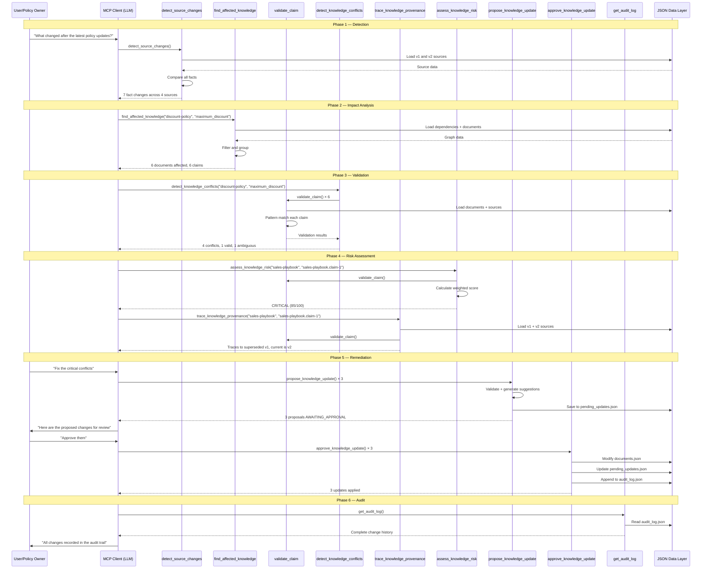

---

## Example End-to-End Workflow

### Scenario: Discount Policy Change

**Context:** The Enterprise Discount Policy changed from v1 (20% max discount) to v2 (10% max discount).

**Step 1: Detection**
```
User: "Has any important company knowledge become invalid after the latest policy changes?"

→ detect_source_changes()

Response: 7 facts changed across 4 sources:
  - discount-policy.maximum_discount: 20% → 10%
  - discount-policy.approval_required_above: 10% → 5%
  - discount-policy.discount_authority: Regional Manager → VP Sales
  - data-retention-policy.retention_period: 5 years → 7 years
  - remote-work-policy.remote_days_per_week: 5 → 3
  - remote-work-policy.equipment_stipend: $500 → $1000
  - security-policy.password_rotation: 180 days → 90 days
```

**Step 2: Impact Analysis**
```
→ find_affected_knowledge("discount-policy", "maximum_discount")

Response: 6 documents affected, 6 claims:
  - sales-playbook (critical, customer-facing): "discounts up to 20%"
  - proposal-template (critical, customer-facing): "discounts up to 20%"
  - pricing-guide (high): "capped at 10%"
  - sales-training (medium): "discounts up to 20%"
  - partner-agreement (critical, customer-facing): "discounts up to 20%"
  - quarterly-review-deck (high, customer-facing): "current policy"
```

**Step 3: Conflict Detection**
```
→ detect_knowledge_conflicts("discount-policy", "maximum_discount")

Response: 4 conflicts, 1 valid, 1 ambiguous
  CONFLICT: sales-playbook (states 20%)
  CONFLICT: proposal-template (states 20%)
  CONFLICT: sales-training (states 20%)
  CONFLICT: partner-agreement (states 20%)
  VALID: pricing-guide (states 10%)
  AMBIGUOUS: quarterly-review-deck (references "current policy")
```

**Step 4: Risk Assessment**
```
→ assess_knowledge_risk("sales-playbook", "sales-playbook.claim-1")

Response: CRITICAL (85/100)
  Factors: customer-facing + financial + operational + confirmed conflict + critical doc
```

**Step 5: Provenance**
```
→ trace_knowledge_provenance("sales-playbook", "sales-playbook.claim-1")

Response: Claims v1 (20%, superseded), current is v2 (10%)
  Conclusion: "This claim references a value inconsistent with the current authoritative value..."
```

**Step 6: Remediation**
```
→ propose_knowledge_update("sales-playbook", "sales-playbook.claim-1")

Response: Proposal created (AWAITING_APPROVAL)
  Current: "Sales representatives can provide discounts up to 20%..."
  Suggested: "Sales representatives can provide discounts up to 10%..."
```

**Step 7: Approval**
```
→ approve_knowledge_update(proposal_id, "Reviewed by policy owner")

Response: Update applied
  documents.json modified
  audit_log.json updated
```

**Step 8: Audit**
```
→ get_audit_log()

Response: [
  {
    action: "UPDATE_APPLIED",
    document: "sales-playbook",
    old: "...discounts up to 20%...",
    new: "...discounts up to 10%...",
    reason: "Reviewed by policy owner",
    risk_level: "CRITICAL",
    timestamp: "2026-07-26T..."
  }
]
```

**LLM Summary:**
> "The Enterprise Discount Policy changed from 20% to 10% maximum discount. I found 6 dependent documents. 4 contain confirmed contradictions. The Sales Playbook is CRITICAL because it is customer-facing, financially sensitive, and the source document is classified as critical. I've proposed and applied the correction. The audit trail records the complete change history."

---

## API Reference

### Public Classes

#### `DataLoaderService`
- `getAuthoritativeSources(): AuthoritativeSource[]`
- `getPreviousSources(): AuthoritativeSource[]`
- `getDocuments(): Document[]`
- `getDependencies(): Dependency[]`
- `getPendingUpdates(): ProposedUpdate[]`
- `getAuditLog(): AuditEntry[]`
- `getSourceById(sourceId: string): AuthoritativeSource | undefined`
- `getPreviousSourceById(sourceId: string): AuthoritativeSource | undefined`
- `getDocumentById(documentId: string): Document | undefined`
- `savePendingUpdates(updates: ProposedUpdate[]): void`
- `saveAuditLog(entries: AuditEntry[]): void`
- `updateDocument(docId: string, claimId: string, newText: string): void`

#### `ChangeDetectionService`
- `detectChanges(sourceId?: string): ChangeDetectionResult`

#### `DependencyService`
- `findAffectedKnowledge(sourceId: string, factKey: string): AffectedKnowledge`
- `findDocumentDependencies(documentId: string): DocumentDependency[]`
- `getFullDependencyTree(sourceId: string): DependencyTree`
- `getDependency(documentId: string, claimId: string): Dependency | undefined`

#### `ValidationService`
- `validateClaim(documentId: string, claimId: string): ClaimValidation`
- `validateAllClaimsForFact(sourceId: string, factKey: string): ClaimValidation[]`

#### `ConflictService`
- `detectConflicts(sourceId: string, factKey: string): ConflictReport`

#### `ProvenanceService`
- `traceClaim(documentId: string, claimId: string): ProvenanceChain`

#### `RiskService`
- `assessRisk(documentId: string, claimId: string): RiskAssessment`

#### `RemediationService`
- `proposeUpdate(documentId: string, claimId: string, suggestedText?: string): ProposedUpdate`
- `proposeUpdates(requests: ProposedUpdateRequest[]): ProposedUpdate[]`
- `approveUpdate(proposalId: string, reason?: string): { update: ProposedUpdate; audit: AuditEntry }`
- `rejectUpdate(proposalId: string, reason?: string): ProposedUpdate`
- `getPendingUpdates(): ProposedUpdate[]`

#### `AuditService`
- `recordEntry(entry: Omit<AuditEntry, 'id' | 'timestamp'>): AuditEntry`
- `getLog(filter?: { documentId?: string; limit?: number }): AuditEntry[]`

### Exported Functions
- `determineStatus(claimText: string, authoritativeValue: string): { status: ValidationStatus; explanation: string }`
- `calculateRiskScore(factors: RiskFactors): number`
- `riskLevel(score: number): RiskAssessment['risk_level']`

### Exported Error Classes
- `KnowledgeDataError` — data integrity violations
- `KnowledgeInputError` — invalid user input

---

## Development Guide

### How to Add a New Tool

1. **Define the service method** in the appropriate service file under `src/services/`
2. **Add the `@Tool` decorator** in `src/modules/knowledge/knowledge.tools.ts`
3. **Define the Zod input schema** using `z.object({...})`
4. **Inject the service** in the `KnowledgeTools` constructor
5. **Add annotations** (`readOnlyHint`, `openWorldHint`)
6. **Write tests** in the appropriate test file

Example:
```typescript
@Tool({
  name: 'my_new_tool',
  description: 'What this tool does',
  inputSchema: z.object({
    param: z.string().describe('Description'),
  }),
  annotations: { readOnlyHint: true, openWorldHint: false },
  invocation: {
    invoking: 'Running my tool...',
    invoked: 'My tool complete.',
  },
})
async myNewTool(input: { param: string }, ctx: ExecutionContext) {
  ctx.logger.info('Running my_new_tool', input);
  return this.myService.myMethod(input.param);
}
```

### How to Add a New Service

1. Create `src/services/my-service.ts`
2. Decorate with `@Injectable({ deps: [...] })`
3. Export from `src/services/index.ts`
4. Register in `KnowledgeIntegrityModule` providers and exports
5. Inject into the appropriate tool handler

### How to Add a New Resource

1. Add a `@Resource` decorated method in `src/modules/knowledge/knowledge.resources.ts`
2. Define the URI, name, description, and MIME type
3. Implement the handler to return data from `DataLoaderService`

### How to Add a New Prompt

1. Add a `@Prompt` decorated method in `src/modules/knowledge/knowledge.prompts.ts`
2. Define the name, description, and arguments
3. Return an array of `{ role, content }` message objects

### How to Add New Authoritative Sources

1. Add the source to `src/data/authoritative_sources.json`
2. Add the corresponding v1 version to `src/data/authoritative_sources_v1.json`
3. Add dependent claims to `src/data/documents.json`
4. Add dependency edges to `src/data/dependencies.json`

### How to Add New Documents

1. Add the document to `src/data/documents.json`
2. Add dependency edges to `src/data/dependencies.json` for each claim that references an authoritative fact

### Coding Conventions

- All TypeScript with `strict: true`
- Use Zod schemas for runtime validation
- Services are stateless (data access through `DataLoaderService`)
- Tool handlers are thin — delegate to services
- Use `KnowledgeInputError` for user input errors, `KnowledgeDataError` for data integrity errors
- All data mutations go through `DataLoaderService` methods
- ESM modules with `.js` extensions in imports

---

## Build & Run

### Installation

```bash
npm install
```

### Development

```bash
npm run dev
```

Starts the NitroStack dev server with hot reload.

### Build

```bash
npm run build
```

Compiles TypeScript to `dist/` directory.

### Testing

```bash
# Phase 4: Core services (detection, dependency, validation, conflict, provenance, risk)
npm run test:phase4

# Phase 5: Same as Phase 4 (shared test suite)
npm run test:phase5

# Phase 6: Same as Phase 4 (shared test suite)
npm run test:phase6

# Phase 7: Remediation (propose, approve, audit)
npm run test:phase7

# Phase 8: Investigation tool, batch operations, prompts
npm run test:phase8

# Phase 9: MCP client connection verification (requires build first)
npm run test:phase9
```

### Running with NitroStudio

1. Run `npm run dev`
2. Open NitroStudio
3. Select the project
4. Verify all 10 tools appear in the tools list
5. Confirm the 3 resources and 2 prompts are discoverable

### Running with Claude Desktop

1. Build the project: `npm run build`
2. Copy `examples/claude-desktop.config.json` to Claude Desktop's MCP configuration
3. Replace the `cwd` placeholder with this project's absolute path
4. Restart Claude Desktop

Configuration:
```json
{
  "mcpServers": {
    "knowledge-integrity": {
      "command": "node",
      "args": ["dist/index.js"],
      "cwd": "/absolute/path/to/my-mcp-server"
    }
  }
}
```

### Environment Variables

| Variable | Default | Description |
|----------|---------|-------------|
| `NITRO_LOG_LEVEL` | `info` | Logging level |
| `NITROSTACK_APP_MODE` | `universal` | Application mode |
| `MCP_TRANSPORT_TYPE` | `stdio` | Transport type (stdio or http-sse) |
| `PORT` | `3000` | HTTP port (for SSE transport) |
| `HOST` | `localhost` | HTTP host (for SSE transport) |

---

## Demo Guide

### Opening (30 seconds)

> "Enterprise knowledge becomes outdated the moment a policy changes. Sales teams quote wrong discounts. Training materials teach wrong processes. Compliance docs reference old rules. Nobody knows until something breaks."

### Problem Statement (30 seconds)

> "When the Enterprise Discount Policy changed from 20% to 10%, how many documents across the company still say 20%? Today, nobody knows. It takes weeks of manual auditing — if it happens at all."

### Live Demo (3-4 minutes)

**Step 1:** *"Let's find what changed."*
- Call `detect_source_changes()` — shows 7 fact changes across 4 policies

**Step 2:** *"What depends on the discount policy?"*
- Call `find_affected_knowledge("discount-policy", "maximum_discount")` — shows 6 affected documents

**Step 3:** *"Are they still accurate?"*
- Call `detect_knowledge_conflicts("discount-policy", "maximum_discount")` — shows 4 conflicts, 1 valid, 1 ambiguous

**Step 4:** *"How dangerous is this?"*
- Call `assess_knowledge_risk("sales-playbook", "sales-playbook.claim-1")` — CRITICAL: customer-facing, financial impact, confirmed conflict

**Step 5:** *"Where did this bad info come from?"*
- Call `trace_knowledge_provenance("sales-playbook", "sales-playbook.claim-1")` — traces to Policy v1, superseded by v2

**Step 6:** *"Fix the critical ones."*
- Call `propose_knowledge_update()` × 3 — proposals created, AWAITING_APPROVAL
- Call `approve_knowledge_update()` × 3 — updates applied

**Step 7:** *"Show me the audit trail."*
- Call `get_audit_log()` — complete change history with timestamps

### Closing (30 seconds)

> "Something changed → what depends on it → what is now wrong → why it's dangerous → what should change → approve → fix → record. That's the complete enterprise knowledge integrity loop, powered by MCP."

### Sample LLM Prompts

| Prompt | Expected Tool Chain |
|--------|-------------------|
| "Has any important company knowledge become invalid after the latest policy changes?" | detect_source_changes → find_affected_knowledge → detect_knowledge_conflicts → assess_knowledge_risk → trace_knowledge_provenance |
| "Fix the critical knowledge conflicts" | propose_knowledge_update → approve_knowledge_update |
| "Show me the audit trail" | get_audit_log |
| "Run a full knowledge health check" | detect_source_changes → find_affected_knowledge → detect_knowledge_conflicts → assess_knowledge_risk → trace_knowledge_provenance |
| "What documents depend on the discount policy?" | find_affected_knowledge |

---

## Troubleshooting

### Common Issues

**Server fails to start:**
- Ensure `npm install` has been run
- Check that `dist/` exists after `npm run build`
- Verify Node.js version ≥ 18

**Tools not appearing in MCP client:**
- Ensure the server is running (`npm run dev` or `node dist/index.js`)
- Check that the MCP client configuration points to the correct path
- Verify the STDIO transport is working (no console errors)

**Data validation errors on startup:**
- The `DataLoaderService` validates all JSON files on first access
- Check `src/data/*.json` for syntax errors
- Ensure all dependency references point to existing sources and documents

**Stale proposal errors:**
- If a proposal's claim text has changed since creation, approval is rejected
- Create a new proposal for the current claim text

**KnowledgeInputError: Unknown authoritative source:**
- Verify the source ID exists in `authoritative_sources.json`
- Source IDs are case-sensitive

### Debugging Tips

1. **Check data integrity:** The `DataLoaderService` validates cross-references on load. If the server starts, the data is consistent.

2. **Trace tool execution:** Each tool logs its invocation via `ctx.logger.info()`. Enable debug logging to see detailed execution flow.

3. **Test services directly:** The test files in `tests/` instantiate services directly without the MCP transport layer. Use them as examples for debugging specific service behavior.

4. **Inspect JSON files:** After running tools that modify data (`approve_knowledge_update`), inspect `src/data/documents.json`, `pending_updates.json`, and `audit_log.json` to verify the changes.

5. **Reset data:** If the knowledge base is in an unexpected state, restore the original JSON files from git:
   ```bash
   git checkout -- src/data/
   ```

---

## Future Improvements

The following are genuine gaps in the current implementation, not features that already exist:

### Indirect Dependencies

The current dependency graph uses only `direct` dependencies. Document-to-document dependencies (e.g., a template that references a playbook that references a policy) are not modeled. Adding indirect dependency traversal would capture deeper cascading effects.

### Multi-Version History

The system currently maintains only two versions (v1 and v2). A real enterprise would have many versions. Supporting a version chain would enable richer provenance tracing and historical analysis.

### Concurrent Access

The current file-based persistence uses synchronous I/O and has no locking mechanism. In a multi-user environment, concurrent approvals could cause data corruption. A database backend or file locking would be needed.

### Semantic Validation

The current claim validation uses pattern matching (regex). It cannot understand that "up to 20%" and "maximum of 20%" are semantically equivalent, or that "up to 15%" is partially outdated. An LLM-in-the-loop validation step could provide deeper semantic analysis.

### Partial Document Updates

Currently, `approve_knowledge_update` replaces the entire claim text. A more sophisticated approach could perform targeted edits within the claim, preserving surrounding context.

### Notification System

When a policy changes, there is no mechanism to proactively notify affected document owners. A webhook or event-driven notification system would improve responsiveness.

### Dashboard / Reporting

The widgets directory exists but is out of scope. A real-time dashboard showing knowledge health metrics, pending proposals, and audit history would improve visibility.

### Role-Based Access Control

Currently, any MCP client can propose and approve changes. An RBAC system could restrict approval authority to document owners or policy managers.

---

## Technical Deep Dive

### Dependency Injection

The project uses NitroStack's `@Injectable` decorator for dependency injection. Services declare their dependencies in the `deps` array:

```typescript
@Injectable({ deps: [DataLoaderService, ValidationService] })
export class RiskService {
  constructor(
    private readonly dataLoader: DataLoaderService,
    private readonly validationService: ValidationService,
  ) {}
}
```

The NitroStack DI container resolves these dependencies when the module is initialized. Services are singletons within the module scope.

### NitroStack Decorators

| Decorator | Purpose | Applied To |
|-----------|---------|-----------|
| `@McpApp` | Configures the MCP server identity | `AppModule` |
| `@Module` | Registers a module with controllers and providers | `AppModule`, `KnowledgeIntegrityModule` |
| `@Tool` | Registers an MCP tool with schema and metadata | Tool handler methods |
| `@Resource` | Registers an MCP resource | Resource handler methods |
| `@Prompt` | Registers an MCP prompt template | Prompt handler methods |
| `@Injectable` | Marks a class for DI resolution | All services |
| `@HealthCheck` | Registers a health check | `SystemHealthCheck` |

### Tool Registration

Tools are registered via the `@Tool` decorator on class methods. The decorator specifies:
- `name`: The MCP tool name (snake_case)
- `description`: What the tool does (used by LLM for tool selection)
- `inputSchema`: Zod schema for input validation
- `annotations`: MCP capabilities (readOnlyHint, openWorldHint)
- `invocation`: Status messages shown during execution

When the MCP server initializes, NitroStack scans all controllers in the module, discovers `@Tool` methods, and registers them with the MCP protocol handler.

### Module Loading

The bootstrapping sequence:
1. `src/index.ts` calls `McpApplicationFactory.create(AppModule)`
2. NitroStack processes `@McpApp` and `@Module` decorators
3. `ConfigModule.forRoot()` loads environment variables
4. `KnowledgeIntegrityModule` is initialized
5. All services are instantiated with DI resolution
6. All controllers are scanned for `@Tool`, `@Resource`, `@Prompt` decorators
7. The MCP server starts listening on the configured transport

### JSON Persistence

All data is persisted as JSON files in `src/data/`. The `DataLoaderService` uses a read-through cache:

1. **First read:** `readFileSync` → `JSON.parse` → Zod validation → cache in memory
2. **Subsequent reads:** Return cached data (no disk I/O)
3. **Writes:** `writeFileSync` to temp file → `renameSync` to target file → update cache

The temp-file-then-rename strategy prevents corruption if the process crashes mid-write.

### State Management

The server maintains two categories of state:

**Static state** (loaded once, never modified by tools):
- `authoritative_sources.json` — current truth
- `authoritative_sources_v1.json` — previous truth
- `documents.json` — enterprise documents (modified only by `approve_knowledge_update`)
- `dependencies.json` — dependency graph

**Dynamic state** (modified by tools at runtime):
- `pending_updates.json` — proposals created/approved/rejected
- `audit_log.json` — change history entries

The `DataLoaderService` caches all data in memory. After a write operation, the in-memory cache is updated to stay consistent with the file.

### Runtime Lifecycle

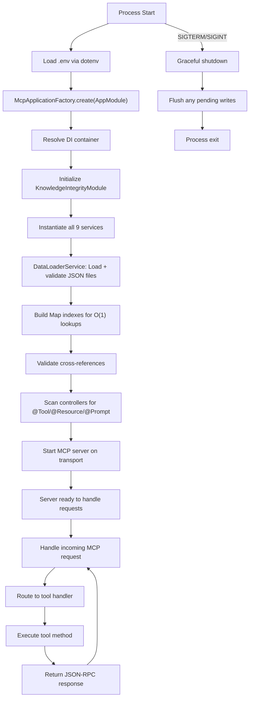
